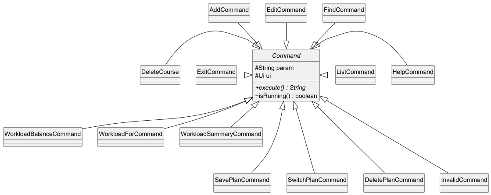
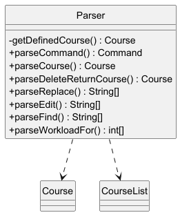
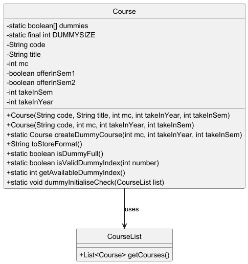
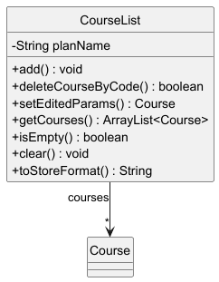
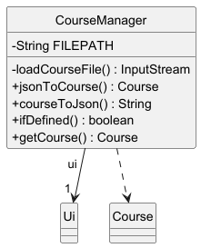
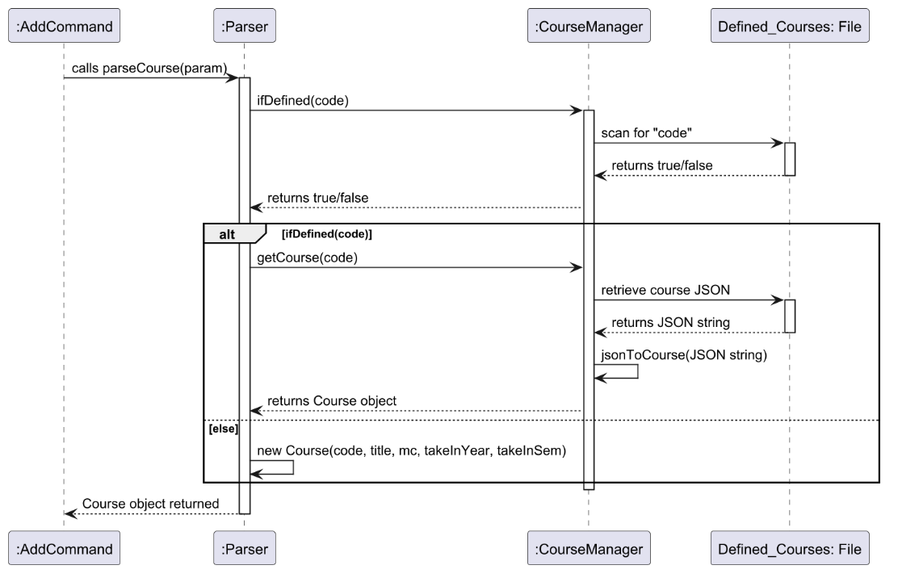
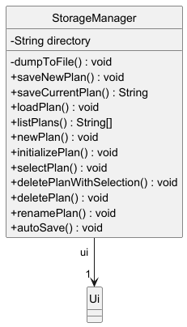
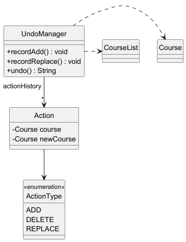
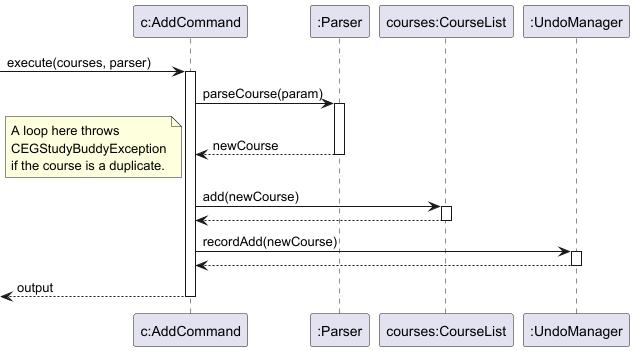

# Developer Guide

## Acknowledgement

This project builds upon the work of:

- [Rishi7830/ip](https://github.com/Rishi7830/ip)  
- [syCHEN1645/ip](https://github.com/syCHEN1645/ip)
- [HightechTR/ip](https://github.com/HightechTR/ip)
- [SahejAgarwal05/ip](https://github.com/SahejAgarwal05/ip)

---

## Setting Up & Getting Started

First, fork the repo, and clone the fork into your computer.

If you plan to use IntelliJ IDEA (highly recommended):
### 1. Configure the JDK: Ensure IntelliJ is configured to use JDK 17.
Follow [this guide](https://se-education.org/guides/tutorials/intellijJdk.html) to configure IDEA.
### 2. Import the project as a Gradle project
Follow [this guide](https://se-education.org/guides/tutorials/intellijImportGradleProject.html) to import the project into IDEA. Note that importing a Gradle project differs slightly from importing a normal Java project.
### 3. Verify the setup:
Run the main class (CEGStudyBuddy.java) and try a few commands.\
Run the tests to ensure they all pass.


---

## Design

### Command Component
The classes in the studybuddy.command package handle commands.\
All of CEGStudyBuddy’s commands have their own command class, which are subclasses of an abstract Command class.



**How it Works:**

- The `parseCommand` method in Parser (see below) returns one of the Command classes.
- The `execute()` method is then run to perform the tasks of the command given.
- The `isRunning()` method is asserted true for all commands except for `ExitCommand`, where it is asserted false.

---

### IO Components
The classes in the studybuddy.data.io package handle input/output functions.

---

#### 1. Parser
The Parser class is a utility class containing methods related to parsing command input.



**Methods:**

- `Command parseCommand(String[] inputParts)`: Instantiates a Command subclass based on the input string.
- `Course parseCourse(String param)`: Instantiates a new Course class with the parameters in the input string.
- `Course getDefinedCourse(String code, int year, int sem)`: Instantiates a predefined Course class with the parameters provided.
- `String parseDeleteReturnCourse(CourseList courses, String param)`: Deletes a course specified in the input string, returns the course deleted.
- `String[] parseEdit(String param)`: Returns a String array with parameters included in the input string for the edit command.
- `String[] parseFind(String param)`: Splits the input string and returns a String array with parameters included for the find command.
- `int[] parseWorkloadFor(String param)`: Splits the input string and returns an int array containing the year and semester for the workload_for command.

The Parser class is not intended to be instantiated.

---

#### 2. UI
The UI class is a utility class containing methods that print or return a string literal. These string literals include error/warning messages, user tips and other interaction messages.

**Methods:**

*As the methods are simple in both their purposes and implementations, 2 typical instances are listed below.

- `String parseIntErrorMessage`: Returns a string "Input cannot be converted to a valid number, please check your input".
- `void printCourse`: Takes in a course object and prints it to the output.

---

#### 3. CommandNames
The CommandNames class contains constants holding the command strings that are checked in the input. These are used in the parseCommand method in Parser.

---

### Course Component
The studybuddy.data package not only contains the aforementioned io package, but also the course package, which contains the classes for storing and handling courses.

---

#### 1. Course
The Course class represents a single course.



**Attributes:**

- `static boolean[] dummies`: A fixed-size array (size 20) tracking the usage of dummy courses. `true` means the dummy index is in use.
- `static final int DUMMYSIZE`: The maximum number of dummy courses allowed (20).
- `static final String DUMMYWORD`: The prefix used in dummy course codes ("DUM").
- `final String DUMMYTITLE`: Default title used for dummy courses ("To be confirmed").
- `String code`: Course Code, e.g. CS2113 or DUM3 for a dummy.
- `String title`: Course Title/Name, e.g. Software Engineering & Object-Oriented Programming.
- `int mc`: Number of modular credits.
- `boolean offerInSem1`: Whether the course is offered in semester 1.
- `boolean offerInSem2`: Whether the course is offered in semester 2.
- `int takeInSem`: The semester the course is taken in.
- `int takeInYear`: The year the course is taken in.

**Methods:**

- `Course(String code, String title, int mc, int takeInYear, int takeInSem)`: Constructs a new course with specified details.
- `Course(String code, int mc, int takeInYear, int takeInSem)`: Constructs a dummy course with a code and default title.
- `static Course createDummyCourse(int mc, int takeInYear, int takeInSem)`: Creates a dummy course and reserves its index.
- `String toStoreFormat()`: Returns a string in storage-friendly format.
- `static boolean isDummyFull()`: Checks whether all dummy slots are used.
- `static boolean isValidDummyIndex(int number)`: Checks if a dummy index is within valid bounds.
- `static int getAvailableDummyIndex()`: Returns the next available dummy index or -1 if full.
- `static void dummyInitialiseCheck(CourseList list)`: Re-initializes the dummy tracking based on existing courses in the current course list.


---

#### 2. CourseList
The CourseList class stores the list of courses and contains methods to modify this course list.



**Attributes:**

- `ArrayList<Course> courses`: The course list itself.
- `String planName`: The name of the course plan the list is used in.

**Methods:**

- `void add(Course course)`: Adds a course to the list. Takes in a Course object.
- `boolean deleteCourseByCode(String code)`: Deletes a course with the given code, returns true if successful.
- `Course setEditedParams(String[] editedParams, Course course)`: Edits the parameters of the course.
- `ArrayList<Course> getCourses()`: Returns the ArrayList of the courses.
- `boolean isEmpty()`: True if the list is empty.
- `void clear()`: Clears the list.
- `String toStoreFormat()`: Return a string representing the CourseList in a format meant for storage.

---

#### 3. CourseManager
The CourseManager class handles reading from the Defined_Courses file and conversion between Course objects and JSON strings.



**Attributes:**

- `String FILEPATH`: Path to the Defined_Courses file.
- `Ui ui`: User interface object for displaying messages.

**Methods:**

- `Course jsonToCourse(String jsonString)`: Converts a JSON-formatted string into a Course object.
- `String courseToJson(Course course)`: Converts a Course object into a JSON-formatted string.
- `boolean ifDefined(String code)`: Checks and returns if a course code exists in the Defined_Courses file.
- `Course getCourse(String code)`: Retrieves a Course object from the Defined_Courses file based on the given course code.

---

#### 4. Predefined List of Courses
Since there is a fixed group of courses which must be completed to fulfill graduation requirements, users can just search for the course codes and load/import these courses from the database (a .txt file) with accurate and complete information. This prevents users from defining these courses themselves using inaccurate information or making careless mistakes such as typos. It also improves user experience by simplifying user input.

When adding a new course into the schedule through AddCommand, AddCommand will search the course code by calling static methods in CourseManager, with a boolean return value isDefined which indicates whether this course is already defined in the database. If true, AddCommand will get the defined course from CourseManager and add it to the schedule. If false, AddCommand will create a new course according to user input and add it to the schedule.

- There is a fixed group of courses to fulfill graduation requirements.
- These are stored in a database file (e.g., `.txt`) to ensure accuracy and avoid user errors.
- When adding a course:
   - The system checks if the course exists in the database via `CourseManager`.
   - If found, it uses that predefined information.
   - If not found, it accepts manual user input.



For the developers, this list is essential for other enhancement functions such as checking graduation requirements by comparing the users’ course plans with the list of core courses. To conveniently save and load from the list, Json dependency is added to convert between courses and Json Strings.

---

### Storage Component
The studybuddy.data.storage package contains the StorageManager class and the CommandHistoryManager class.

---

#### 1. StorageManager
The StorageManager class handles storage related tasks like creating new plans,  saving changes to plans and deleting plans. For storage, it uses the PlanData folder and creates one if needed.
- The `StorageManager` class handles all file-related operations.
- It creates a `PlanData` folder to store data if one doesn’t already exist.
- It loads the user’s course plan at startup and saves changes automatically.



**Attributes**
- `Ui ui`: Ui object responsible for user interaction related operations.
- `String directory`: Directory in which the plans are stored and read from.

**Methods:**

- `void saveNewPlan(String plan)`: Creates and saves a new plan. If a plan with the same name exists or an error occurs, it throws an exception.
- `String saveCurrentPlan()`: Saves the currently loaded plan to storage and returns a success message.
- `void loadPlan(String planName)`: Loads a saved plan by its name and sets it as the current plan; throws an exception if the plan does not exist or the data is corrupted.
- `String[] listPlans()`: Returns an array of saved plan names (without the ".txt" extension); throws an exception if no plans are found.
- `void newPlan()`: Prompts the user to input a valid alphanumeric name for a new plan and saves it.
- `void initializePlan()`: Initiates the plan selection process, repeating on error until a valid plan is selected.
- `void selectPlan()`: Allows the user to either choose an existing plan or create a new one, throwing an exception for invalid selections.
- `void deletePlanWithSelection()`: Enables the user to select a plan from the list and delete it, handling errors appropriately.
- `void deletePlan(String planName)`: Deletes the specified plan after obtaining user confirmation; if the plan doesn't exist, an exception is thrown.
- `void renamePlan()`: Renames the current plan after validating the new plan name; throws an exception if the new name is invalid or already in use.
- `void autoSave()`: Automatically saves the current plan by writing its data to storage.
- `private void dumpToFile(File file, String data)`: Writes the given data to the specified file; used internally by various save methods and throws an exception if an error occurs.

---

#### 2. CommandHistoryManager
insert description


---

#### 3. UndoManager
insert description



---

### Exceptions
The studybuddy.data.exception package contains the CEGStudyBuddyException class. It handles exceptions that are special to CEGStudyBuddy and cannot be categorised by the exception classes in Java’s own packages, e.g. having no saved course plan at all, having a semester number greater than 2, etc. It is also used to print out a customised error message on screen.

---

## Implementation

Details of the implementation of a few noteworthy features of CEGStudyBuddy is listed in this section.

---

### Adding a Course
A simplified sequence diagram of the AddCommand class implementation:



---

### Saving Course Plans

The implementation of the StorageManager class:

**`initializePlan()` Method Overview**

The `initializePlan()` method guarantees that a valid study plan is loaded before the application continues. It repeatedly prompts the user to select or create a plan until a successful selection is made.

***Detailed Process***

1. **Setup:**
   - Initializes a control flag (`initRun`) to manage the plan initialization loop.

2. **Plan Selection Loop:**
   - Enters a loop that calls the `selectPlan()` method to load or create a study plan.
   - Before each iteration, it assumes success by setting `initRun` to `false`.

3. **Error Handling:**
   - If `selectPlan()` fails (e.g., due to an invalid selection or corrupted data), an exception is thrown.
   - The exception is caught, an error message is displayed via `ui.showError()`, and the loop restarts by setting `initRun` back to `true`.

4. **Successful Initialization:**
   - The loop terminates once a plan is successfully loaded without exceptions.
   - At this point, the application has a valid study plan and can proceed safely.

---

**`selectPlan()` Method Overview**

The `selectPlan()` method enables the user to choose an existing study plan or create a new one. It retrieves available plans, validates user input, and loads the selected plan accordingly.

***Detailed Overview***

1. **Retrieve Existing Plans:**
   - Attempts to list saved plans using `listPlans()`.
   - If no plans are available, it displays a message via `ui.noPreviousPlansMessage()` and then calls `newPlan()` to create a new plan.

2. **User Prompt for Selection:**
   - Presents the available plans as a numbered list through `ui.chooseOrCreateNewPlans(plans)`.
   - The user can select an existing plan by its number or opt to create a new plan by entering "0".

3. **Input Validation and Processing:**
   - If the user enters "0", the `newPlan()` method is invoked to create a new plan.
   - Otherwise, the input is parsed as an integer to identify the selected plan.
   - If the input is non-numeric or falls outside the valid range, an exception is thrown.

4. **Plan Loading:**
   - Loads the chosen plan by calling `loadPlan()` with the corresponding plan name.
   - If an error occurs during loading (e.g., due to corrupted data), an exception is thrown.

5. **Confirmation:**
   - Once the plan is successfully loaded, a confirmation message is displayed via `ui.planSuccessfullyLoadedMessage()`.

---

**`loadPlan()` Method Overview**

The `loadPlan()` method is responsible for loading a saved study plan by its name and setting it as the current plan in the application.

***Detailed Overview***

1. **Directory Verification:**
   - Checks if the storage directory exists. If not, it creates the directory and throws an exception indicating that there are no saved plans.

2. **Plan File Existence Check:**
   - Constructs the file path for the plan (appending ".txt" to the plan name) and verifies its existence.
   - If the file does not exist, an exception is thrown with the message "Invalid Plan Name".

3. **Plan Data Loading:**
   - Reads the plan file content and splits it by newline characters.
   - Iterates through each non-empty line and parses it into course data using `Parser.parseCourse(line)`.
   - Adds each parsed course to a new `CourseList` object initialized with the plan name.

4. **Setting the Current Plan:**
   - Updates the global current plan (`CEGStudyBuddy.courses`) with the newly loaded `CourseList`.

5. **Error Handling:**
   - If an exception occurs during file reading or parsing, it throws a "Data Source Corrupted" exception.

---

**`listPlans()` Method Overview**

The `listPlans()` method retrieves all saved study plans from the designated storage directory and returns an array of plan names without their file extensions.

***Detailed Overview***

1. **Directory Verification:**
   - Checks if the storage directory exists.
   - If the directory does not exist, it creates the directory and throws an exception indicating that there are no saved plans.

2. **Listing Plan Files:**
   - Searches the directory for files ending with ".txt".
   - If no such files are found or the list is null, an exception is thrown indicating that there are no saved plans.

3. **Processing File Names:**
   - Iterates over the list of plan files.
   - Removes the ".txt" extension from each file name to produce a clean list of plan names.

4. **Returning the Plan List:**
   - Returns an array of plan names without the file extensions for further use in the application.

---

**`newPlan()` Method Overview**

The `newPlan()` method facilitates the creation of a new study plan by prompting the user to input a valid, alphanumeric plan name and then saving the plan.

***Detailed Overview***

1. **User Input for New Plan:**
   - The method repeatedly prompts the user for a new plan name until a non-empty, valid name is provided.

2. **Validation:**
   - Validates the input to ensure it contains only alphanumeric characters (rejecting any special characters).
   - If the input does not match the required pattern, the prompt is repeated.

3. **Saving the New Plan:**
   - Once a valid plan name is obtained, the method calls `saveNewPlan(planName)` to create and save the new plan.
   - If a plan with the same name already exists or if an error occurs during saving, an exception is thrown.

4. **User Feedback:**
   - On successful creation, a confirmation message is displayed via `ui.createNewPlanMessage()`.
   - If any error occurs, the corresponding error message is shown using `ui.showError(e.getMessage())`.

---

**`selectPlan()` Method Overview**

The `selectPlan()` method enables the user to choose an existing study plan or create a new one. It retrieves available plans, validates user input, and loads the selected plan accordingly.

***Detailed Overview***

1. **Retrieve Existing Plans:**
   - Attempts to list saved plans using `listPlans()`.
   - If no plans are available, it displays a message via `ui.noPreviousPlansMessage()` and then calls `newPlan()` to create a new plan.

2. **User Prompt for Selection:**
   - Presents the available plans as a numbered list through `ui.chooseOrCreateNewPlans(plans)`.
   - The user can select an existing plan by its number or opt to create a new plan by entering "0".

3. **Input Validation and Processing:**
   - If the user enters "0", the `newPlan()` method is invoked to create a new plan.
   - Otherwise, the input is parsed as an integer to identify the selected plan.
   - If the input is non-numeric or falls outside the valid range, an exception is thrown.

4. **Plan Loading:**
   - Loads the chosen plan by calling `loadPlan()` with the corresponding plan name.
   - If an error occurs during loading (e.g., due to corrupted data), an exception is thrown.

5. **Confirmation:**
   - Once the plan is successfully loaded, a confirmation message is displayed via `ui.planSuccessfullyLoadedMessage()`.

---

**`deletePlanWithSelection()` Method Overview**

The `deletePlanWithSelection()` method allows the user to select and delete an existing study plan. It handles the process of listing available plans, validating the user's selection, and delegating the deletion to the appropriate method.

***Detailed Overview***

1. **Retrieving Available Plans:**
   - Attempts to fetch the list of saved plans using `listPlans()`.
   - If no plans are found, it displays a message via `ui.noPreviousPlansMessage()` and exits the method.

2. **User Prompt for Deletion:**
   - Displays a numbered list of plans and prompts the user to choose which plan to delete using `ui.chooseDeletePlan(plans)`.

3. **Input Validation:**
   - Parses the user's input as an integer to determine the selected plan.
   - If parsing fails, throws an exception with the message "Invalid plan number".
   - Validates that the number is within the acceptable range; if not, throws an exception with the message "plan number out of range".

4. **Plan Deletion:**
   - Calls the `deletePlan()` method with the chosen plan name to perform the deletion.
   - If an error occurs during deletion, an exception with the message "Error deleting plan" is thrown.

---

**`deletePlan(String planName)` Method Overview**

The `deletePlan(String planName)` method is responsible for deleting a specified study plan from storage. It ensures that the deletion is intentional by prompting the user for confirmation and handles file removal safely.

***Detailed Overview***

1. **User Confirmation:**
   - Prompts the user with a confirmation message using `ui.isUserConfirm("Are you sure you want to delete " + planName)`.
   - If the user does not confirm, displays a cancellation message via `ui.cancelMessage()` and exits without deleting the plan.

2. **Directory and File Verification:**
   - Verifies that the storage directory exists; if it does not, the directory is created.
   - Constructs the file path by appending ".txt" to the provided `planName` and checks if the corresponding plan file exists.
   - If the plan file does not exist, throws an exception with the message "Plan does not exist".

3. **Deletion Process:**
   - If the plan file exists, it is deleted from the storage directory.

4. **Post-Deletion Handling:**
   - Upon successful deletion, displays a success message using `ui.displaySuccessfullyDeletedMessage()`.
   - If the deleted plan was the currently loaded plan, it calls `initializePlan()` to prompt the user to select or create a new plan.

---

## Appendix A: Product Scope

### Target User Profile

- Undergraduate students studying **Computer Engineering** at **NUS**
- Prefer desktop applications over mobile/web apps
- Comfortable using **Command-Line Interfaces (CLI)**
- Can type quickly and accurately
- Want fast, structured ways to plan academic roadmaps
- Want to track courses, balance workload, and ensure graduation requirements are met
- Prefer minimal effort with maximum clarity of academic progress

### Value Proposition

**CEGStudyBuddy** helps Computer Engineering students manage their module planning in a faster, more organized, and minimalist way compared to GUI-based apps like NUSMods.  
It is optimized for typing-focused power users and automatically tracks MCs, graduation requirements, and allows editing or deleting modules via simple commands.  
It is **cross-platform** and **free**.

---

## Appendix B: User Stories

### Tracking and Planning Courses

- As a CEG student, I want to add a course to my study plan so I can track my progress toward graduation.
- As a CEG student, I want to remove a course from my study plan so I can update my roadmap if I change my mind.
- As a CEG student, I want to list all the courses I have added so that I can have an overview of my academic plan.
- As a CEG student, I want to delete courses I added by mistake so my plan remains accurate.

### Optimizing Workload and Schedule

- As a CEG student, I want to see my total workload in MCs per semester so that I can balance my workload and avoid overloading.
- As a student living in Pasir Ris, I want to plan my modules around travel time so I minimize time lost commuting.

### Graduation Requirements

- As a CEG student, I want to check which modules I still need to complete for graduation so that I can plan my semesters.
- As a CEG student, I want to be warned if I add a course without prerequisites so I don’t enroll in courses I’m not eligible for.

### Keeping Students Organized & On Track

- As a CEG student, I want to search for a course by its course code or name so I can quickly find relevant details about it.

---

## Appendix C: Non-functional Requirements

- Should work on any mainstream OS with Java 17 installed
- Should be able to handle up to 100 courses
- All features must be accessible via CLI commands only (no GUI required)
- A user with decent typing speed should be able to perform tasks faster than in GUI-based alternatives
- Should be memory-efficient and not require persistent internet access

---

## Appendix D: Glossary

| Term               | Definition                                                  |
|--------------------|-------------------------------------------------------------|
| CEG                | NUS Computer Engineering                                    |
| Module Code        | Official code of an NUS course, e.g., `CS2040C`             |
| MC                 | Modular Credits – indicates course weight                   |
| Course List        | The user’s personalized list of planned/taken courses       |
| Command Parser     | Handles interpretation of typed commands                    |
| Workload Tracker   | Computes workload distribution across semesters             |
| Graduation Checker | Validates whether graduation requirements (160 MCs) are met |

---

## Appendix E: Instructions for Manual Testing

#### Launching the Application

1. Ensure Java 17 is installed.
2. Download the `.jar` file and place it in an empty folder.
3. Open Command Prompt (Windows) or Terminal (macOS/Linux).
4. Navigate to the folder using `cd`.
5. Run the program:
   ```java -jar cegstudybuddy.jar```
   

---

### Adding a Course

Command:
```
add c/CS2040 t/Data Structures mc/4 y/2 s/1
```

**Test Cases:**
- Omitting slashes (e.g., `c CS2040`)
- Missing required tags (e.g., no `mc/`)
- Negative MCs (e.g., `mc/-4`)
- Using letters in year or semester fields

---

### Deleting a Course

Command:
```
delete c/CS2040
```

**Test Cases:**
- Missing `c/` tag
- Non-existent module codes
- Lowercase codes (should still work)

---

### Editing a Course

Command:
```
edit c/CS2040 t/Advanced Data mc/5 y/2 s/2
```

**Test Cases:**
- Missing `c/` (primary identifier)
- Invalid year/sem values
- Only one optional tag (should still work)

---

### Listing Courses

Command:
```
list
```

**Test Cases:**
- When course list is empty (should show message)
- When course list is long (check readability)

---

### Finding a Course

Command:
```
find c/CS2040
```

**Test Cases:**
- Finding non-existent course
- Missing `c/`
- Using lowercase input (should work)

---

### Viewing Workload

Command:
```
workload
```

**Test Cases:**
- After adding 6+ courses, check that MCs are grouped by semester correctly

---

### Viewing Graduation Requirement

Command:
```
gradreq
```

**Test Cases:**
- Below 160 MCs → motivational message + thumbs up emoji
- 160 MCs or more → celebratory message + graduation ASCII/emoji

---

### Adding a Dummy Course

Command:
```
dummy mc/4 y/2 s/1
```

**Test Cases:**
- Extra input parameters (e.g., `dummy t/Dummy mc/4 y/2 s/1`)
- Fail to add a dummy after dummy number reaches 20
- Valid case: Adding a new dummy course with correct parameters (e.g., `dummy mc/4 y/2 s/1`)
```


